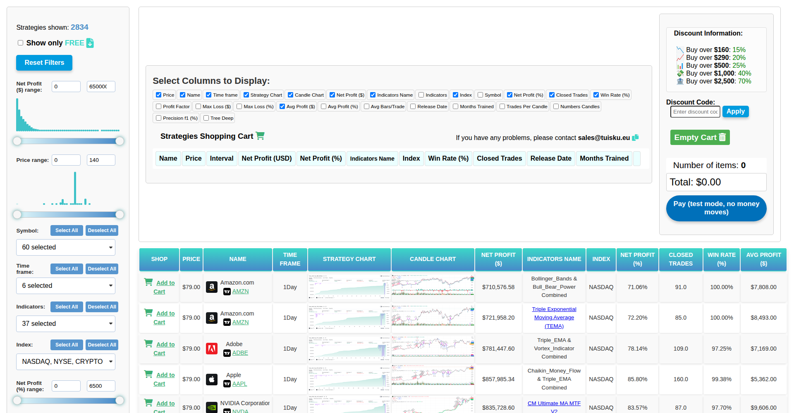
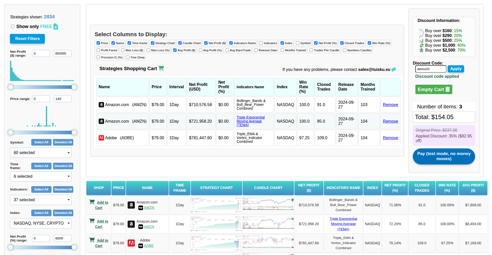
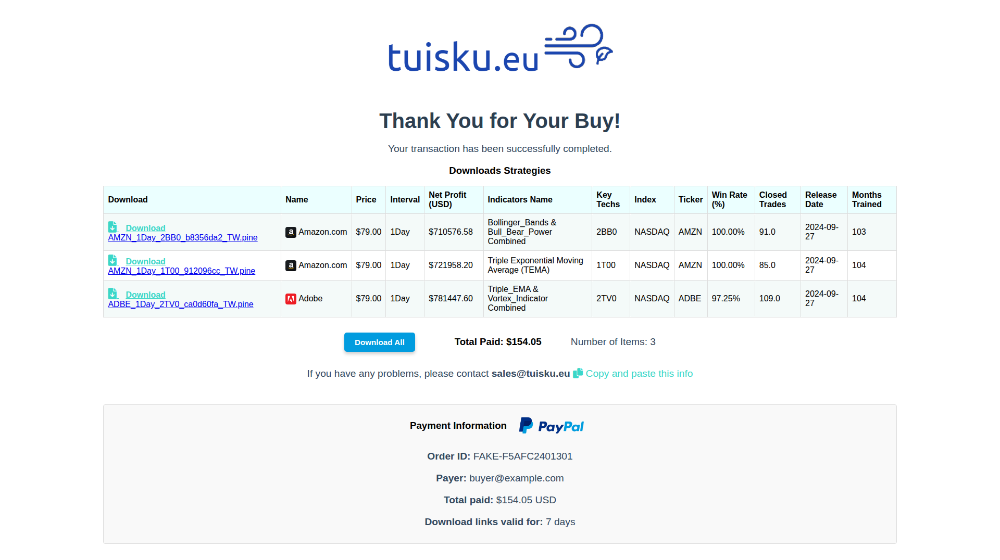

# tuisku · TradingView strategy shop

The shop behind tuisku.eu: a catalogue of **2,834 TradingView strategies** (Pine Script v5) with
their backtest results, filters, a cart, PayPal checkout, and a small server that prices the
cart and hands out the paid files only after PayPal confirms the payment.

<p align="center">
  
</p>

<table>
<tr>
<td width="55%"></td>
<td width="45%"></td>
</tr>
<tr>
<td><sub>The cart. Every total on this panel comes from the server; the discount tiers are read from it too.</sub></td>
<td><sub>After payment: one download link per strategy, valid 7 days.</sub></td>
</tr>
</table>

<sub>Screenshots from `tools/screenshots.py`, which buys three strategies in a real browser
against a local server in test mode.</sub>

## Run it locally

```bash
pip install -r api/requirements.txt
PAYPAL_MODE=fake DISCOUNT_CODES=demo20=0.20 uvicorn --factory api.app:create_app --port 8000
# open http://localhost:8000
```

In `fake` mode there is no PayPal: a "Pay (test mode)" button completes the order, so the whole
flow, downloads included, works offline. Downloads need the paid scripts in `private/strategies/`
(see [Private storage](#private-storage)).

## How a purchase works

```
browser                                  server (api/)                         PayPal
  │ POST /api/quote {items, code} ────────▶ prices from catalogue.csv,
  │ ◀──────────────── total, discount ──── tiers + code, capped at 70%
  │ POST /api/orders {items, code} ───────▶ same price ──────────────────────▶ create order
  │ ◀───────────────────────── order id ─────────────────────────────────────┘
  │ buyer approves in the PayPal window
  │ POST /api/orders/{id}/capture ────────▶ capture ─────────────────────────▶ money moves
  │                                          amount = order total? ◀─────────┘
  │ ◀────────── receipt + one link per file
  │ GET /api/download/{token} ────────────▶ file from private storage
```

The browser only ever sends item ids and the code the buyer typed. It holds no price it can
change, no discount code, and no path to a paid file.

## Configuration

All from environment variables (`api/settings.py`):

| Variable | Default | |
|---|---|---|
| `PAYPAL_MODE` | `fake` | `fake`, `sandbox` or `live` |
| `PAYPAL_CLIENT_ID`, `PAYPAL_CLIENT_SECRET` | | from a REST app in the PayPal developer dashboard; required outside `fake` |
| `STRATEGIES_DIR` | `private/strategies` | the paid `.pine` files |
| `DATABASE` | `private/shop.db` | orders and download links (SQLite) |
| `DISCOUNT_CODES` | none | `code=rate` pairs, e.g. `spring20=0.20,partner40=0.40` |
| `FLAT_PRICE_CODES` | none | `code=price` pairs that set every item to one price |
| `MAX_DISCOUNT` | `0.70` | cap on order-size tier + code together |
| `DOWNLOAD_DAYS`, `MAX_DOWNLOADS` | `7`, `10` | life of a download link |

Order-size discounts (over $160: 15%, $290: 20%, $500: 25%, $1,000: 40%, $2,500: 70%) are in
`api/settings.py`; the page draws its list from `/api/config`, so the two cannot disagree.

## Private storage

The paid scripts are **not in this repository** any more. The server reads them from
`STRATEGIES_DIR`, with the names the strategy factory gives them (its `pine_TW_b/` folder), so
that folder can be copied there as it is. Until this branch, the same files were in the public
repository; to get them back for private storage:

```bash
git checkout c3fa796 -- d_result/pine_TW_b && mkdir -p private && mv d_result/pine_TW_b private/strategies
```

They also stay in the repository's history, where anyone can still fetch them. To close that
for good, publish this branch as a new repository (or rewrite the history) before selling again.

## Publishing a new catalogue

The strategy factory (the private `ML-Sklearn-strategy-stock-crypto-for-TraderView` repository)
writes a tab-separated export with the TradingView backtest of each strategy. To publish it:

```bash
python catalogue/publish.py path/to/pine_TW_img_info_6_WEB.csv --assets path/to/factory/d_result --prune
```

It keeps one row per strategy (the export repeats some), makes every image path relative, drops
the location of the paid file, copies the charts and previews the rows use, and deletes the
ones no row uses. Then copy the new paid scripts to `STRATEGIES_DIR`.

## Layout

```
storefront/   the static site: index.html, thankyou.html, css/, js/, vendor/ (simpleCart, fSelect)
  assets/       charts (5,668), previews (2,834), icons, sprites; only what the catalogue uses
api/          FastAPI: orders.py (quote, create), capture.py, download.py, pricing, PayPal, SQLite
catalogue/    catalogue.csv (prices for the page and the server), indicators.csv, publish.py
tests/        prices, discounts, payment checks, download links, what must stay out of the page
tools/        screenshots.py: the end-to-end purchase in a browser, and these README images
docs/         images, the column descriptions and the ChatGPT prompts the page was built with
```

```bash
pip install -r requirements-dev.txt && pytest      # 20 tests, no network, PayPal faked
```

## Deploying

One process serves everything: `uvicorn --factory api.app:create_app --host 0.0.0.0 --port 8000`
behind HTTPS (any host that runs Python: a small VPS, Render, Railway, Fly.io), with the variables
above and `private/` on a disk that is not served. Try `PAYPAL_MODE=sandbox` with sandbox
credentials first. The site no longer loads images from raw.githubusercontent.com: everything is
served from `storefront/`.

## Before selling again

The strategies were generated on 2024-10-18 and carry a "recommended expiry" of 2025-06-18. A
review of the generator found that about a third of the strategies compute their indicators
differently in TradingView than in the Python that trained them, and that the Ichimoku family
used future prices in training. Regenerate the catalogue with those fixed before relaunching.

## What changed from the old site

- Prices, discounts and the PayPal amount were computed in the browser: the cart could be edited
  to any price, and a 60% code plus the 70% tier gave a negative total. Now the server computes
  them, with a cap.
- The five discount codes were in the page, only base64-hidden. They are now environment
  variables, and the old ones no longer work.
- The thank-you page built download links from the cart, with no payment check, and every paid
  script was downloadable from GitHub. Now links are issued per paid order and files live
  outside the repository.
- Removed from the repository: the 7,222 full scripts of `pine_TW/` (never used by the page), the
  4,578 paid scripts, 7,033 charts and 1,744 previews no row used, an old copy of the page, an
  unused script and CSV, and a full strategy at the root. 1.4 GB → about 570 MB.
- The page title was "jQuery UI Sliders with Interactive Histograms", the discount list did not
  match the discounts applied, 92 repeated rows were listed, and this README described another
  project.
